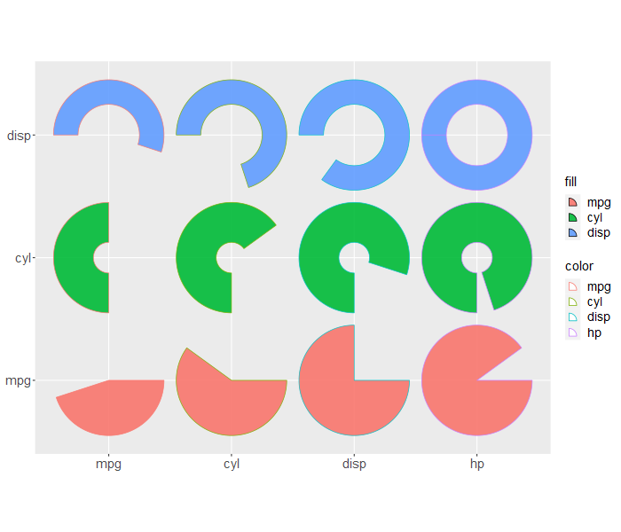

---
output:
  md_document:
    variant: gfm
html_preview: false
---

<!-- README.md is generated from README.Rmd. Please edit that file -->

```{r, include = FALSE}
knitr::opts_chunk$set(
  collapse = TRUE,
  comment = "#>",
  fig.path = "man/figures/README-",
  out.width = "100%",
  message = FALSE,
  warning = FALSE
)
```

```{r echo=FALSE, results="hide", message=FALSE}
library("badger")
```

# ggsector: Easily draw sectors with grid and ggplot2

<!-- badges: start -->
[](http://www.repostatus.org/#active)

[](https://cran.r-project.org/package=ggsector)
`r badge_devel("yanpd01/ggsector", "deepgreen")`


<!-- [](https://cran.r-project.org/package=ggsector) -->
<!-- []() -->


`r badger::badge_custom("Windows", "passing", "deepgreen")`
`r badger::badge_custom("Linux", "passing", "deepgreen")`
<!-- badges: end -->

```{r comment="", echo=FALSE, results='asis'}
cat(packageDescription("ggsector")$Description)
```

## :writing_hand: Authors

Pengdong Yan


## :arrow_double_down: Installation

Get the released version from Cran:

```{r, eval = FALSE}
install.packages("ggsector")
```

Or the development version from github or gitee:

```{r, eval = FALSE}
## install.packages("remotes")

## from github
# simple install
remotes::install_github("yanpd01/ggsector")
# with vignettes
remotes::install_github("yanpd01/ggsector", build_vignettes = TRUE)

## from gitee
# simple install
remotes::install_git("https://gitee.com/yanpd01/ggsector")
# with vignettes
remotes::install_git("https://gitee.com/yanpd01/ggsector", build_vignettes = TRUE)
```


##  :books: Usage

For more details, please refer to the online
[vignette](https://cran.r-project.org/web/packages/ggsector/vignettes/ggsector.html).



## :sparkling_heart: Acknowledgments

The code of this R package refers to [jjplot](https://github.com/junjunlab/jjPlot) of [JunJunLao](https://github.com/junjunlab) and [ggplot2](https://github.com/tidyverse/ggplot2) of [Hadley](https://github.com/hadley).

The Description, vignette, and readme of this R package refer to [clusterProfiler](https://github.com/YuLab-SMU/clusterProfiler), [ggfun](https://github.com/YuLab-SMU/ggfun), and [treeio](https://github.com/YuLab-SMU/treeio) of [Guangchuang YU](https://github.com/YuLab-SMU/).

Here, I would like to express my highest respect to thank the big guys for their open source spirit.


